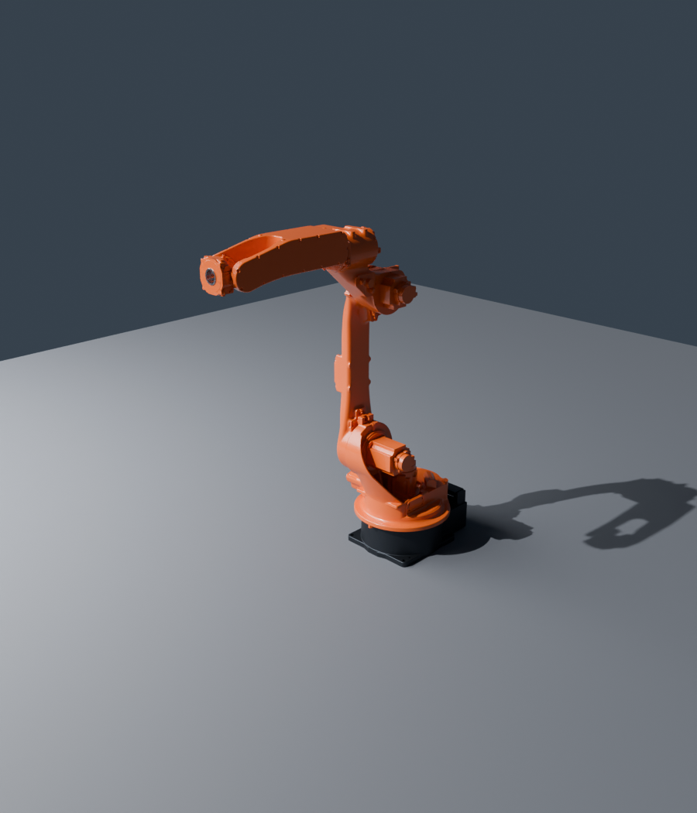
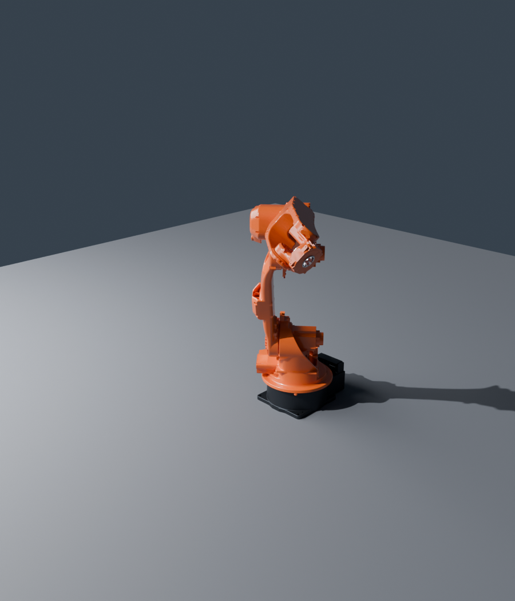

# Yaskawa Motoman GP25 — articulated asset

Real-time, articulated 3D model of the Yaskawa Motoman **GP25** 6-axis industrial
robot, prepared for use in CAVR Studio as a poseable visualization asset.

| | |
|---|---|
|  |  |
| Home pose (all joints 0) | Example joint configuration |

## Files

| File | Purpose |
|------|---------|
| `gp25.glb`              | glTF 2.0 binary mesh with the full kinematic node hierarchy and PBR materials. |
| `gp25.kinematics.json`  | Language-agnostic joint descriptor: axes, origins, limits, speeds, link↔node map. |
| `preview_*.png`         | Reference renders. |

**Materials:** the five arm castings (S, L, U, R, B) are industrial-orange
painted lacquer (`#e85f12`), the base is dark cast metal (`#3b3f45`), and the
tool flange (T) is machined steel. CAVR Studio re-skins these with tuned PBR
materials at runtime; the same split is baked into `gp25.glb`.

The C++ mirror of the descriptor lives in
[`robot_model.hpp`](../../../libs/visualization/include/cavr/visualization/robot_model.hpp)
(`cavr::visualization::yaskawa_gp25()`), with a forward-kinematics helper.

## Kinematics

6R vertical articulated arm. Frame is **Y-up, metres**, matching glTF. Each joint
rotates about its axis expressed in the joint-local frame (right-hand rule).
At the home pose every joint frame is axis-aligned with the world frame.

| Axis | glTF node | Origin vs parent [m] | Axis | Range [°] | Max speed [°/s] |
|------|-----------|----------------------|------|-----------|------------------|
| S | `joint_s` | (0, 0.169, 0)        | +Y | −180 … 180 | 210 |
| L | `joint_l` | (−0.157, 0.336, 0.150) | +X | −105 … 155 | 210 |
| U | `joint_u` | (0.157, 0.760, 0)    | +X | −86 … 160  | 265 |
| R | `joint_r` | (0, 0.200, 0.302)    | +Z | −200 … 200 | 420 |
| B | `joint_b` | (0, 0, 0.493)        | +X | −150 … 150 | 420 |
| T | `joint_t` | (0, 0, 0)            | +Z | −455 … 455 | 885 |
| TCP | `tcp`   | (0, 0, 0.101) vs T   | —  | —          | —   |

Node hierarchy:

```
GP25 (root)
└─ link_base                      [mesh, fixed]
   └─ joint_s ─ link_s            S  (+Y)
      └─ joint_l ─ link_l         L  (+X)
         └─ joint_u ─ link_u      U  (+X)
            └─ joint_r ─ link_r   R  (+Z)
               └─ joint_b ─ link_b B (+X)
                  └─ joint_t ─ link_t  T (+Z)
                     └─ tcp       tool-centre point
```

**To pose the robot:** set the local rotation of each `joint_*` node to the
commanded joint angle about its axis. The link meshes are offset so each joint
node's origin already sits on the rotation axis — no per-frame correction needed.

> Joint **positive directions** follow the right-hand rule about the listed axis.
> The sign and zero offset of a physical Motoman controller are applied as a
> per-joint calibration (sign + offset) at commissioning; the geometry here is
> the kinematic ground truth.

## Datasheet

Yaskawa Motoman GP25 / YRC1000: payload 25 kg, horizontal reach 1730 mm,
repeatability ±0.06 mm, mass 250 kg. Axis ranges and speeds above are from the
official GP25 specification table.

## Provenance & regeneration

Built from the original CAD (`GP25.stp`, a SolidWorks STEP export whose components
are pre-named `_S_AXIS`, `_L_AXIS`, … — one solid per link). The asset is fully
reproducible:

1. `scripts/assets/freecad_export_gp25_links.py` — FreeCAD headless: imports the
   STEP, tessellates each named link to a separate mesh.
2. `scripts/assets/blender_build_gp25.py` — Blender headless: builds the joint
   hierarchy at the extracted axis origins, assigns the orange/steel materials,
   decimates, and exports `gp25.glb`.

See [`scripts/assets/README.md`](../../../scripts/assets/README.md).

The CAD source is **not** redistributed in this repository; only the derived,
decimated visualization mesh. Confirm licensing of the source model before
distribution.
